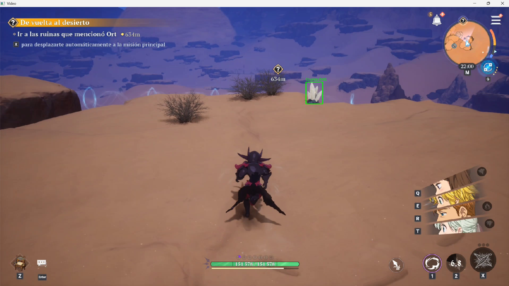

# Detección de Minerales con YOLO (Ultralytics) y OpenCV

## Descripción del proyecto

Este proyecto implementa un pipeline de inferencia para la **detección de minerales** en video, utilizando un modelo **YOLO entrenado previamente** (`best.pt`, correspondiente al Avance 3 del proyecto) junto con la librería **Ultralytics**.

El script carga el modelo, procesa un video frame por frame, y dibuja sobre cada frame —utilizando exclusivamente **OpenCV**— las cajas delimitadoras, la clase detectada y el nivel de confianza de cada predicción. El objetivo es evaluar el desempeño del modelo entrenado sobre videos nuevos, distintos a los usados durante el entrenamiento.

Las clases detectadas por el modelo son minerales tales como **piedra solar**, **platino** y **cuarzo**.

## Librerías necesarias

- **[Ultralytics](https://pypi.org/project/ultralytics/)**: framework que implementa YOLO, usado para cargar el modelo entrenado y realizar la inferencia (detección de objetos) sobre cada frame del video.
- **[OpenCV](https://pypi.org/project/opencv-python/)** (`opencv-python`): usado para leer el video, dibujar las cajas delimitadoras, etiquetas y confianza sobre los frames, y mostrar el resultado en una ventana.
- **pathlib**: incluida en la librería estándar de Python, usada para el manejo de rutas de archivos.

### Instalación

```shell
python -m pip install --upgrade pip
pip install ultralytics opencv-python
```

> Al instalar `ultralytics` se instalan automáticamente sus dependencias (PyTorch, NumPy, etc.), por lo que no es necesario instalarlas por separado.

## Estructura del repositorio

```
├── inference.py          # Script principal de inferencia
├── best.pt               # Modelo YOLO entrenado (Avance 3)
├── Minerales.mp4         # Video de prueba 1
├── Minerales2.mp4        # Video de prueba 2
├── Mineral.png           #Imagen de ejemplo con inferencia  
└── README.md
```

## Uso

1. Ubicar `best.pt` y los videos de prueba en la misma carpeta que el script.
2. En el código, seleccionar el video a analizar modificando la variable `video_path` (`Minerales.mp4` o `Minerales2.mp4`).
3. Ejecutar:

```shell
python inference.py
```

4. Se abrirá una ventana mostrando el video con las detecciones en tiempo real. Presionar **ESC** para cerrar la ventana y finalizar la ejecución.

## Ejemplo de inferencia

*Detección de minerales sobre un frame del video, con caja delimitadora, clase y confianza asociada.*


## Análisis de desempeño

El umbral de confianza se fijó en **0.7**. Inicialmente se probó un umbral de 0.45 (según la curva F1-Confidence del modelo), pero se observaron varios falsos positivos. Al subir el umbral a 0.7 (basado en la curva Precision-Confidence), estos falsos positivos desaparecieron, a costa de detectar una menor cantidad de objetos.

**Aciertos:**
- El modelo identifica correctamente los minerales presentes en el video, con buenos niveles de confianza.
- La clase con mejor desempeño es **piedra solar**.
- **Platino** y **cuarzo** muestran un desempeño levemente inferior a piedra solar, pero siguen siendo detectados de forma confiable.

**Limitaciones:**
- Dificultad para detectar objetos pequeños o parcialmente ocultos.
- Menor precisión en zonas alejadas del centro de la cámara del jugador.
